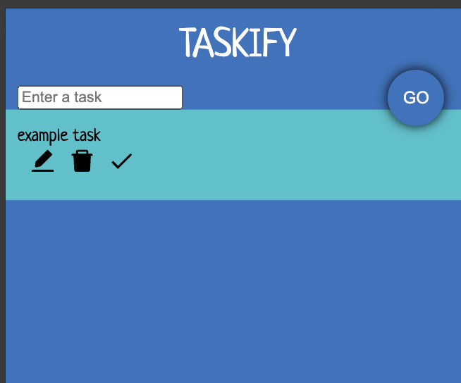

# Practising Typescript with a Todo App

### FreeCodeCamp - React & Typescript
#### By /roadsidecoder
[Youtube Tutorial](https://www.youtube.com/watch?v=FJDVKeh7RJI)

##### Points covered:
- How to install typescript
- How TS defines variables and how to define the different types, inclduign objects, arrays and functions
- How to assign more than one type
- Uses "type" and "interface"
- Installed VS:ES7 React extension to autogenerate boilerplagte arrow functions (rafce)
- useRef to reference a HTML attribute to change focus and background colours
- Used installed react-icons for use of edit, delete and done icons
- Learned a shortcut of assigning classNames

##### Screenshot

